# Buildings

## bldg001

**File Name:** bldg001.gml

**Description:** bldg001 is a building object which has LOD0, LOD1, LOD2 and LOD3 representations as MultiSurfaces and Solids

**Tags:** lod0MultiSurface, lod1Solid, lod2Solid, lod3Solid

```stl
solid 
facet normal 0 0 -1
 outer loop
  vertex 0 12 0
  vertex 12 12 0
  vertex 12 0 0
 endloop
endfacet
facet normal 0 0 -1
 outer loop
  vertex 0 12 0
  vertex 12 0 0
  vertex 0 0 0
 endloop
endfacet
facet normal 0 0 1
 outer loop
  vertex 12 12 6
  vertex 0 12 6
  vertex 0 0 6
 endloop
endfacet
facet normal 0 -0 1
 outer loop
  vertex 12 12 6
  vertex 0 0 6
  vertex 12 0 6
 endloop
endfacet
facet normal -1 -0 -0
 outer loop
  vertex 0 0 0
  vertex 0 0 6
  vertex 0 12 6
 endloop
endfacet
facet normal -1 -0 0
 outer loop
  vertex 0 0 0
  vertex 0 12 6
  vertex 0 12 0
 endloop
endfacet
facet normal 0 1 0
 outer loop
  vertex 0 12 0
  vertex 0 12 6
  vertex 12 12 6
 endloop
endfacet
facet normal 0 1 -0
 outer loop
  vertex 0 12 0
  vertex 12 12 6
  vertex 12 12 0
 endloop
endfacet
facet normal 0 -1 0
 outer loop
  vertex 12 0 0
  vertex 12 0 6
  vertex 0 0 6
 endloop
endfacet
facet normal 0 -1 0
 outer loop
  vertex 12 0 0
  vertex 0 0 6
  vertex 0 0 0
 endloop
endfacet
facet normal 1 -0 0
 outer loop
  vertex 12 12 0
  vertex 12 12 6
  vertex 12 0 6
 endloop
endfacet
facet normal 1 -0 0
 outer loop
  vertex 12 12 0
  vertex 12 0 6
  vertex 12 0 0
 endloop
endfacet
endsolid 

```

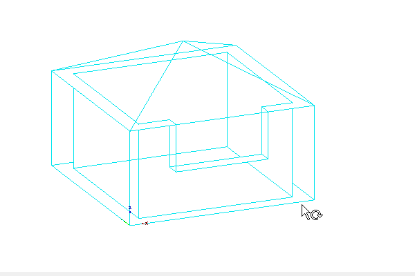
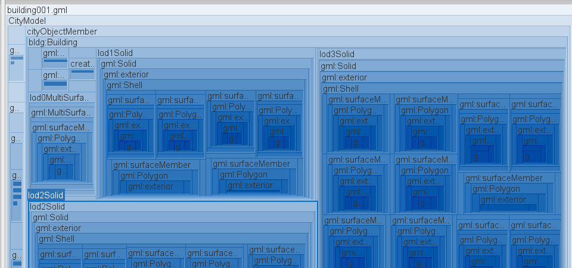

## bldg002

**File Name:** bldg002.gml

**Description:** bldg002 is a building object which has Boundaries (ground, roof & walls) and linked (xlink) LOD representations as solids

**Tags:** GroundSurface, RoofSurface, WallSurface, Xlink, lod0MultiSurface, lod1Solid, lod2Solid, lod3Solid

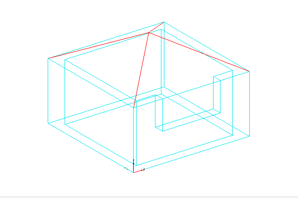
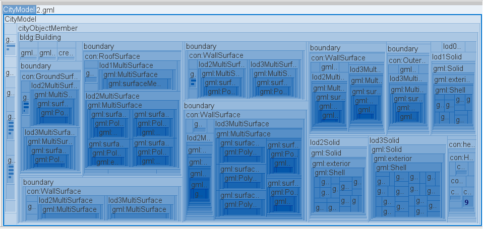

## bldg003

**File Name:** bldg003.gml

**Description:** Bldg003 is a building object which has only LOD2 representation as Solid and consists of PolygonPatches.

**Tags:** PolygonPatch, lod2Solid, Building

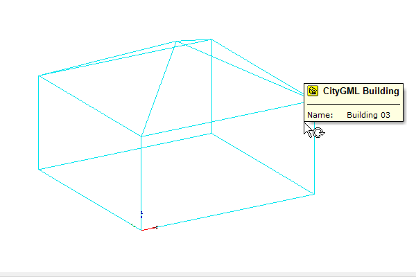


## bldg008

**File Name:** bldg008.gml

**Description:** Building 008 is a building object which has LOD3 representation as Solid and lod3 TerrainInterSection as MultiCurve. Additionally it consists of Storeys based on Solids.

**Tags:** lod3Solid, lod3TerrainIntersectionCurve, Building, Storey

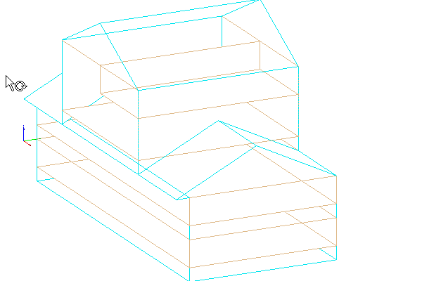
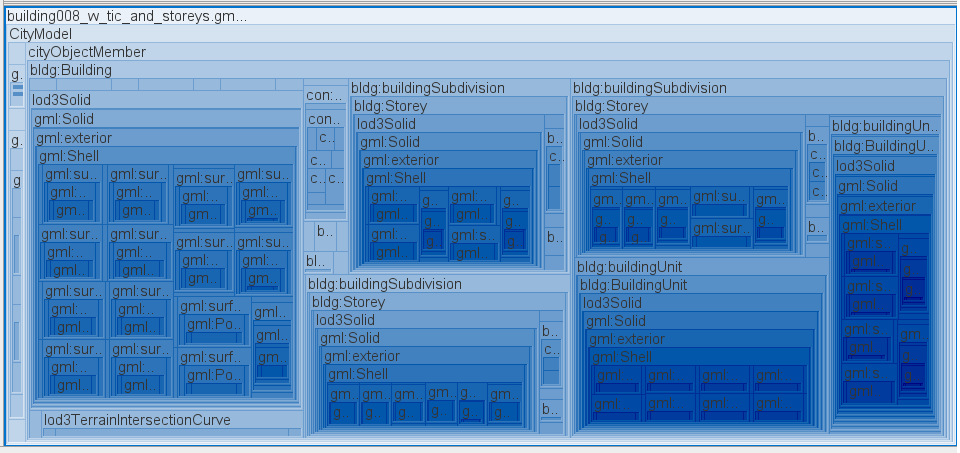

## bldg009

**File Name:** bldg009.gml

**Description:** Building09 is a building object which has only LOD3 representation as MultiSurfaces with CompositeSurface elements.

**Tags:** CompositeSurface, lod3MultiSurface, Building

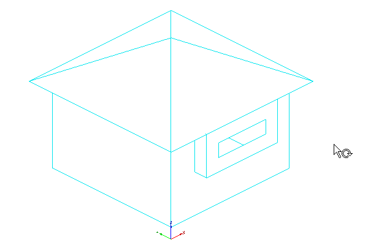
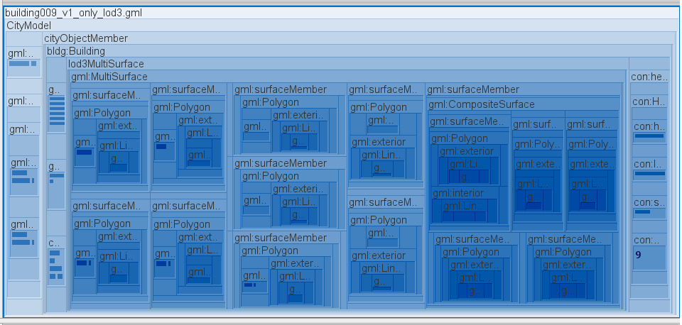

## bldg010

**File Name:** bldg010.gml

**Description:** Building010 is a building object which has Boundaries and linked LOD representations and additionally rooms, windows and doors.

**Tags:** lod3MultiSurface, lod3Solid, Building, GroundSurface, RoofSurface, WallSurface, OuterCeilingSurface, DoorSurface, WindowSurface, FloorSurface, InteriorWallSurface, CeilingSurface, BuildingRoom

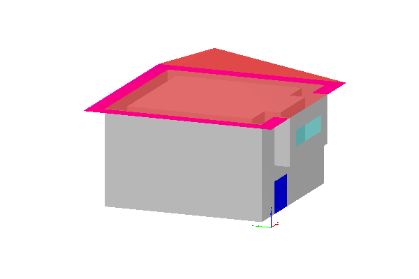
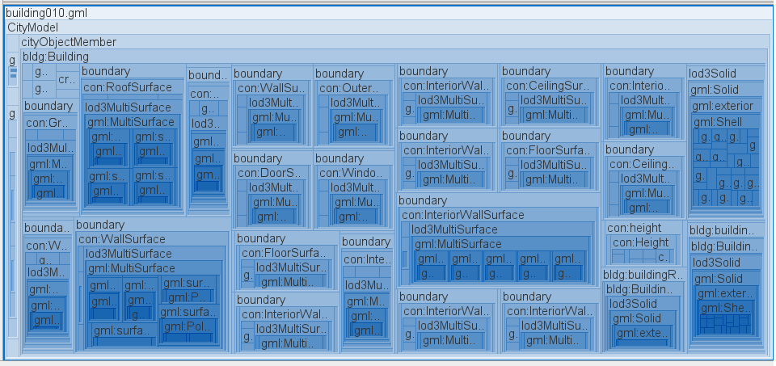