# Building Subvariants

## Subvariants of bldg001

### bldg001_only_lod0

**File Name:** bldg001_only_lod0.gml

**Description:** bldg001_only_lod0 is a building object which has only LOD0 representation as MultiSurface

**Tags:** lod0MultiSurface

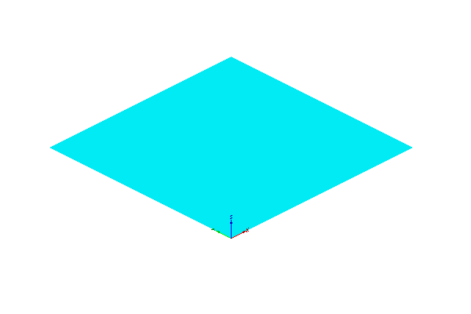
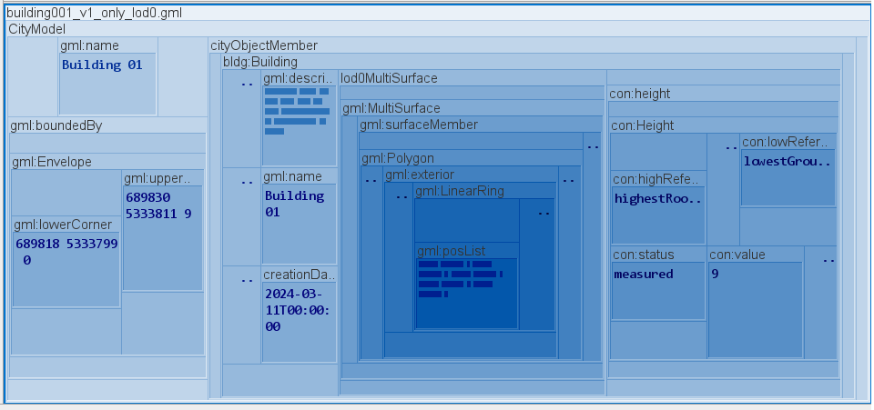

### bldg001_only_lod1

**File Name:** bldg001_only_lod1.gml

**Description:** bldg001_only_lod1 is a building object which has only LOD1 representation as Solid

**Tags:** lod1Solid

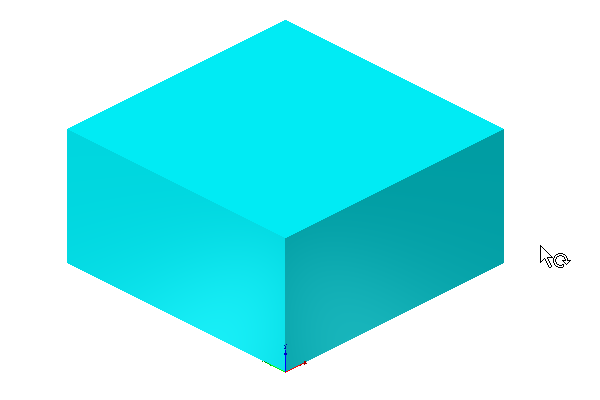
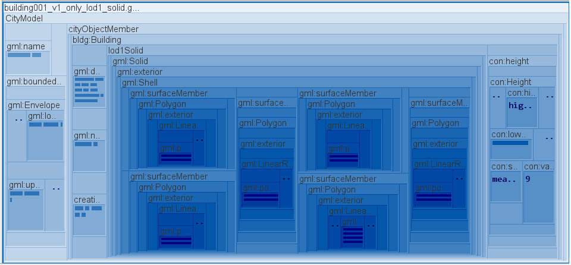

### bldg001_only_lod2

**File Name:** bldg001_only_lod2.gml

**Description:** bldg001_only_lod2 is a building object which has only LOD2 representation as Solid

**Tags:** lod2Solid

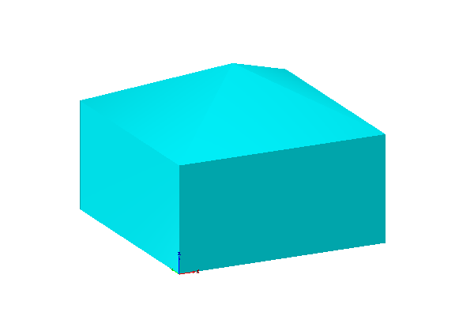
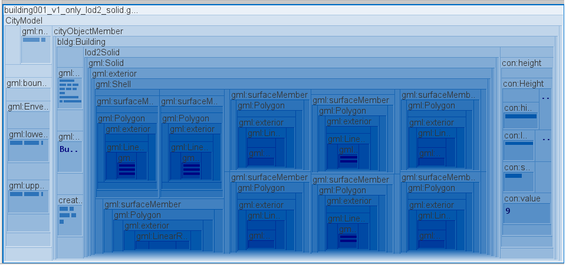

### bldg001_only_lod3

**File Name:** bldg001_only_lod3.gml

**Description:** bldg001_only_lod3 is a building object which has only LOD3 representation as Solid

**Tags:** lod3Solid

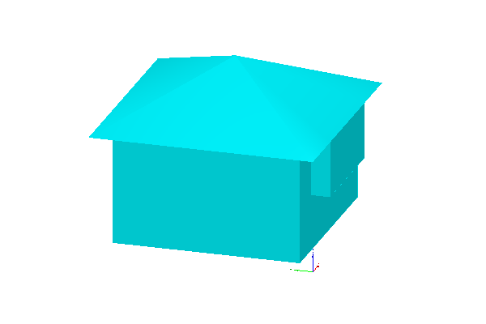
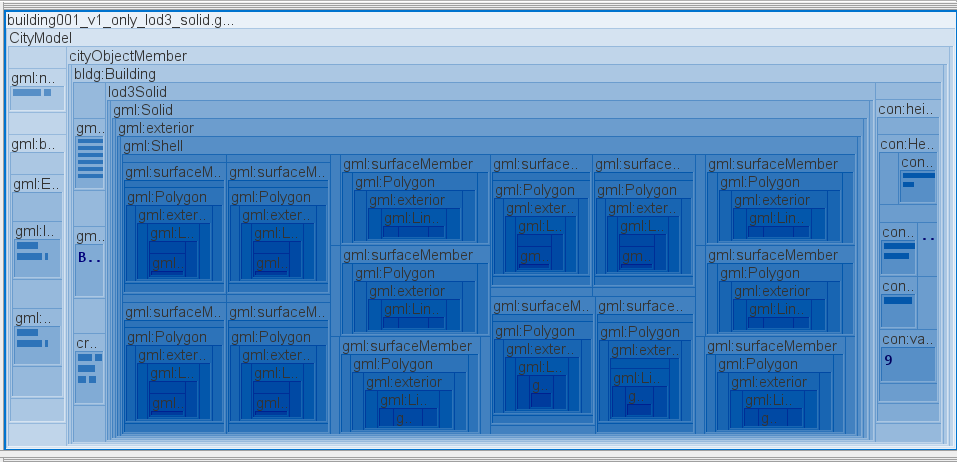

## Subvariants of bldg002

### bldg002_only_lod0

**File Name:** bldg002_only_lod0.gml

**Description:** bldg002_only_lod0 is a building object which has only one boundary (GroundSurface) and linked LOD representation as MultiSurface
**Tags:** GroundSurface, xlink, lod0MultiSurface

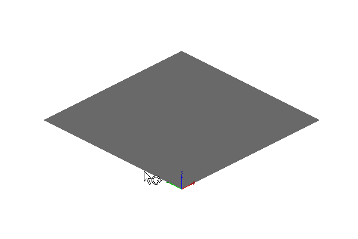
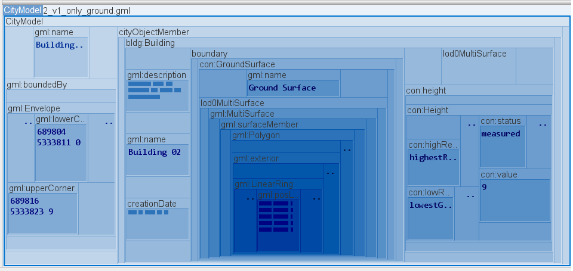

### bldg002_only_lod1

**File Name:** bldg002_only_lod1.gml

**Description:** bldg002_only_lod1 is a building object which has boundaries (GroundSurface, RoofSurface & WallSurface) and linked LOD representation as Solid

**Tags:** GroundSurface, RoofSurface, WallSurface, xlink, lod1MultiSurface, lod1Solid

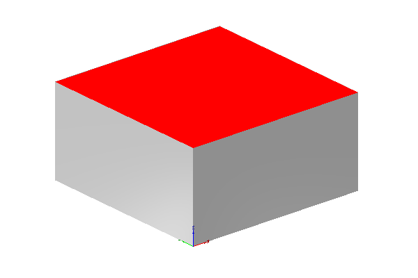
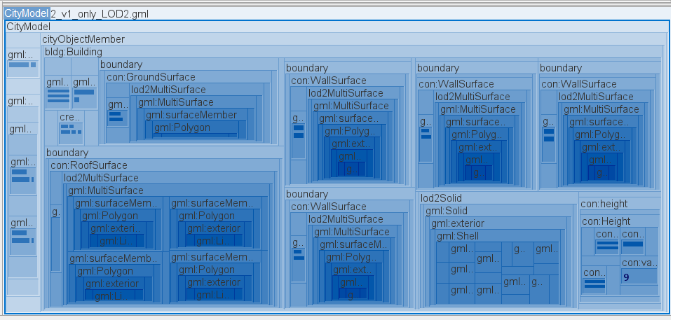

### bldg002_only_lod2

**File Name:** bldg002_only_lod2.gml

**Description:** bldg002_only_lod2 is a building object which has boundaries (GroundSurface, RoofSurface & WallSurface) and linked LOD representation as Solid

**Tags:** GroundSurface, RoofSurface, WallSurface, xlink, lod2MultiSurface, lod2Solid

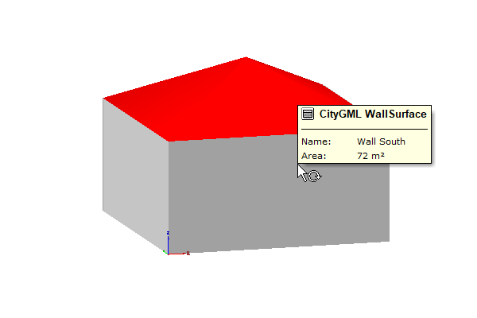

### bldg002_only_lod3

**File Name:** bldg002_only_lod3.gml

**Description:** bldg002_only_lod3 is a building object which has boundaries (GroundSurface, RoofSurface, OuterCeilingSurface & WallSurface) and linked LOD representation as Solid

**Tags:** GroundSurface, RoofSurface, WallSurface, OuterCeilingSurface, xlink, lod3MultiSurface, lod3Solid

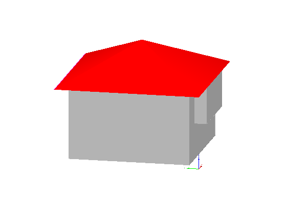
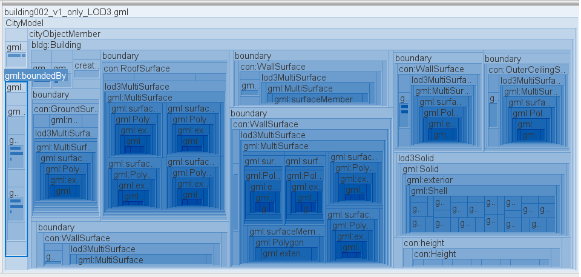