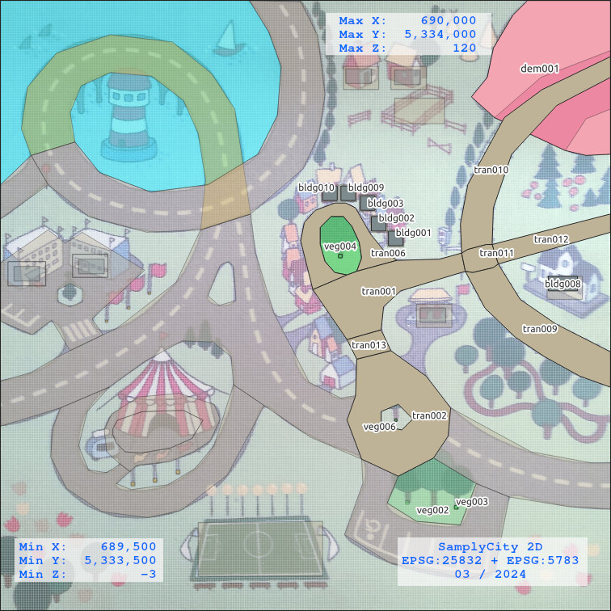
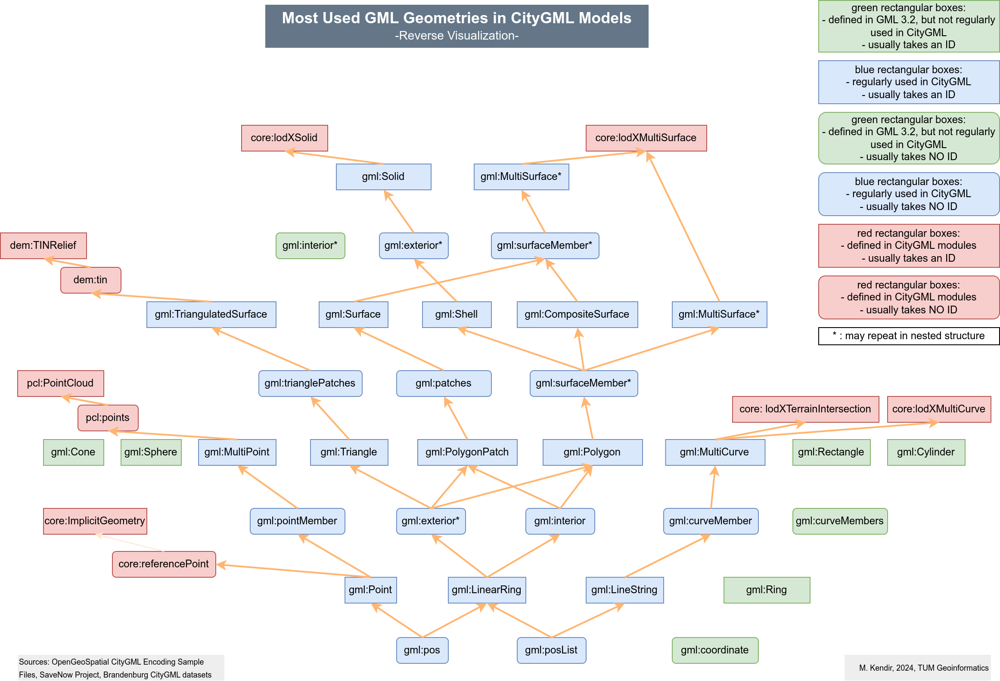

#SamplyCity

## Simple samples of CityGML 3.0 in the name of simplicity.

- Stage 1 (Progress: %95) : SamplyCity aims to reflect regularly used geometry representations in CityGML 3.0 files.
- Stage 2 (Progress: % 60): SamplyCity aims to consist at least one sample per module.
- Stage 3 (Progress: 30%): SamplyCity aims to reflect all possible data structure scenarios within itself. 

## Feedback 

Please feel free to send feedback if you notice an error or bug in the files.

**[Click here](https://forms.gle/zAFmvnkLprLUaN3AA){:target="_blank"} to send me your feedback.**

## SamplyCity Manifest

- No decimal coordinates.
- Less vertices as much as possible.
- Hierarchical (GML)ID assignment for all entities. 
- Document the results of the experiments with different software/tools for every file individually.

## A visualization of the most used geometry representations in CityGML 2.0/3.0

This visual is designed to represent the hierarchical data structure of GML geometries reversly (from sub to superb).

## Control and Compatibility Table of CityGML Files

 **File Name** | **Validation by citygml-tools** | **Viewable in FME Data Inspector** | **Viewable in KIT Model Viewer** | **Uploadable to Cesium Ion** 
:---:|:---:|:---:|:---:|:---:
 **bldg001** | 1 | 1 | 1 | 1 
 **bldg001_only_lod0** | 1 | 1 | 1 | 1 
 **bldg001_only_lod1** | 1 | 1 | 1 | 1 
 **bldg001_only_lod2** | 1 | 1 | 1 | 1 
 **bldg001_only_lod3** | 1 | 1 | 1 | 1 
 **bldg002** | 1 | 1 | 1 | 0 
 **bldg002_only_lod0** | 1 | 1 | 1 | 0 
 **bldg002_only_lod1** | 1 | 0 | 1 | 0 
 **bldg002_only_lod2** | 1 | 1 | 1 | 0 
 **bldg002_only_lod3** | 1 | 1 | 1 | 0 
 **bldg003** | 1 | 1 | 1 | 1 
 **bldg008** | 1 | 1 | 1 | 1 
 **bldg009** | 1 | 1 | 1 | 1 
 **bldg010** | 1 | 1 | 1 | 0 
 **tran001** | 1 | 1 | 1 | 1 
 **tran002** | 1 | 1 | 1 | 1 
 **tran006** | 1 | 1 | 1 | 1 
 **tran009** | 1 | 1 | 1 | 1 
 **tran010** | 1 | 1 | 1 | 1 
 **tran011** | 1 | 0 | 1 | 1 
 **tran012** | 1 | 1 | 1 | 0 
 **tran013** | 1 | 1 | 1 | 0 
 **veg002** | 1 | 0 | 0 | 0 
 **veg004** | 1 | 1 | 1 | 1 
 **veg005** | 1 | 1 | 0 | 1 
 **veg006** | 1 | 0 | 0 | 0 
 **dem001** | 1 | 1 | 0 | 1 

