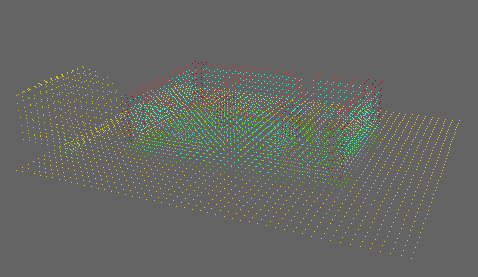
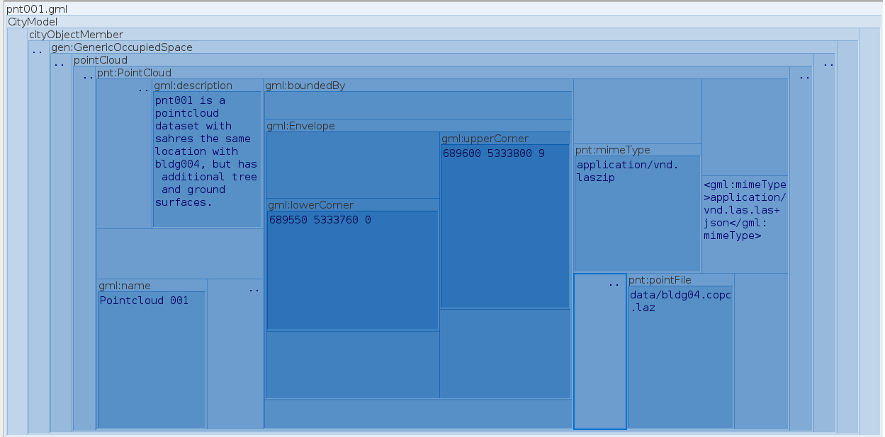
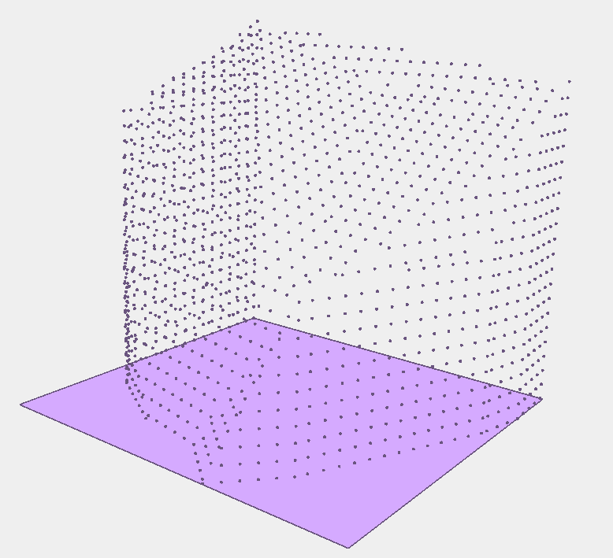
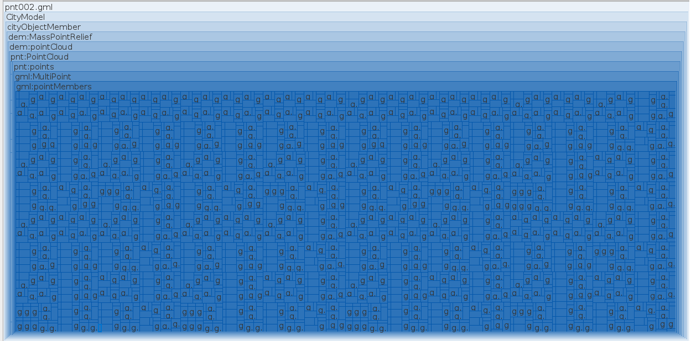

# PointCloud Objects

## pnt001

**File Name:** pnt001.gml

**Description:** pnt001 is a pointcloud dataset with the same location with bldg004, but has additional tree and ground surfaces. The point cloud dataset is in cloud optimized LAS/Zip format and called from the CityGML file.

**Tags:** GenericOccupiedSpace, PointCloud, pointFile, COPC, LAS

## pnt002

**File Name:** pnt002.gml

**Description:** pnt002 is a internally stored pointcloud dataset and shares the same location and geometry with dem001.

**Tags:** MassPointRelief, PointCloud, MultiPoint

