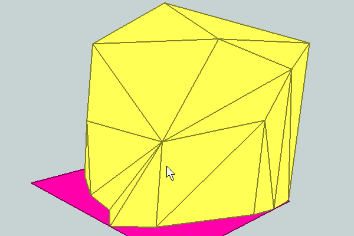
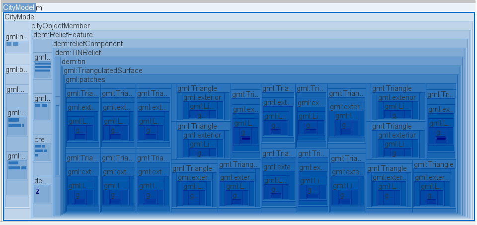

# Relief Objects

## dem001

**File Name:** dem001.gml

**Description:** DEM 001 is a relief object which has only LOD2 representation as TIN.

**Tags:** TriangulatedSurface, TINRelief, ReliefFeature

