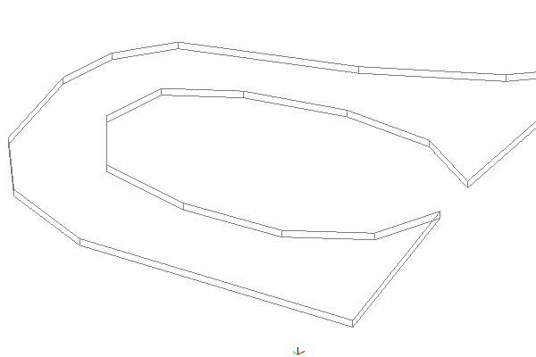

# Transportation Objects

## tran001

**File Name:** tran001.gml

**Description:** Tran001 is a road section which has LOD0 and LOD2 representations as MultiSurface and Solid

**Tags:** lod0MultiSurface, lod2Solid, Road

## tran002

**File Name:** tran002.gml

**Description:** Tran002 is a road-road intersection which has trafficarea and trafficspace objects in LOD0 and LOD1 representations as MultiCurve and Solid

**Tags:** lod0MultiCurve, lod1Solid, Road, Marking, Intersection, TrafficSpace, TrafficArea

## tran006

**File Name:** tran006.gml

**Description:** Tran006 is a road object which has LOD0 and LOD1 representations as MultiSurface and Solid

**Tags:** lod0MultiSurface, lod1Solid, Road

## tran009

**File Name:** tran009.gml

**Description:** Tran009 is a railway object which has LOD0 representation as MultiSurface

**Tags:** lod0MultiSurface, Railway

## tran011

**File Name:** tran011.gml

**Description:** Tran011 is a road-railway intersection which has LOD0 and LOD3 representations as MultiSurface and Solid

**Tags:** lod0MultiSurface, lod3Solid, Railway, Road, Intersection

## tran012

**File Name:** tran012.gml

**Description:** Tran012 is a road section which has LOD1 representation as Solid

**Tags:** lod1Solid, Road, Section

## tran013

**File Name:** tran013.gml

**Description:** Tran013 is a road-track intersection which has LOD1 representation as Solid

**Tags:** lod1Solid, xlink, Road, Track, Intersection

