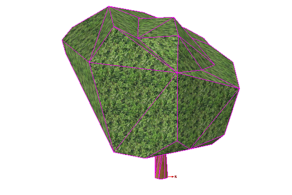
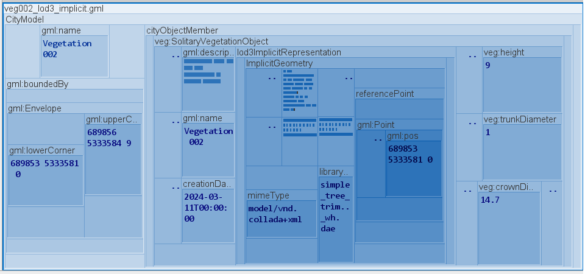
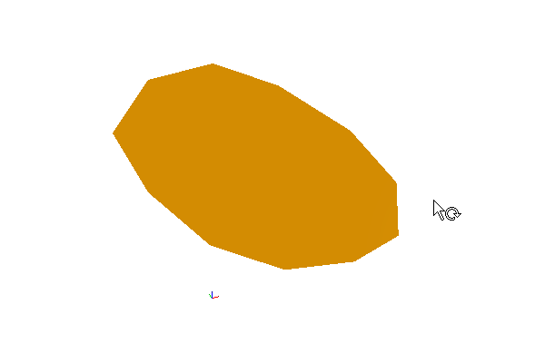
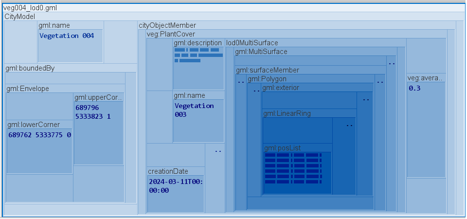
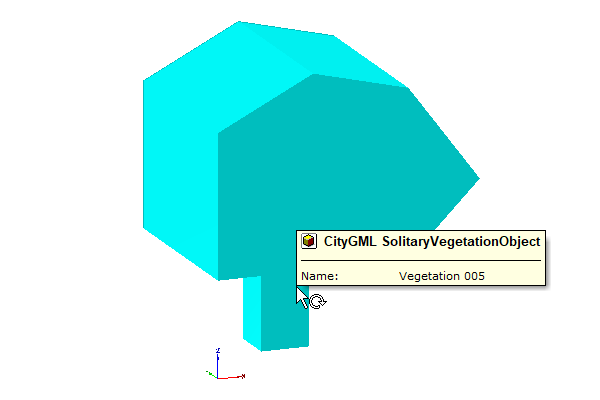
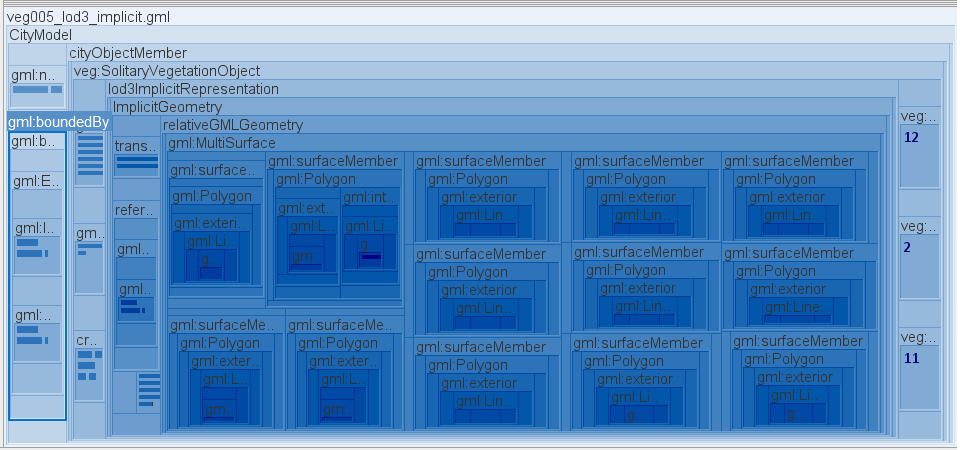
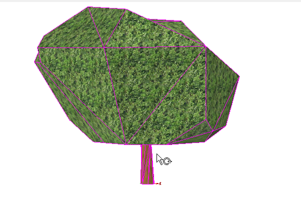
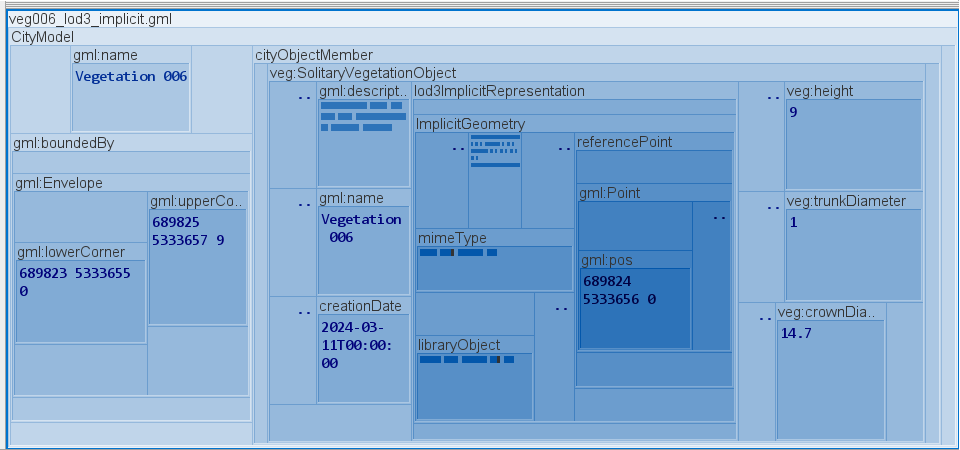

# Vegetation Objects

## veg002

**File Name:** veg002.gml

**Description:** Veg002 is a tree which has only LOD3 representation as implicit geometry (external Collada file).

**Tags:** lod3ImplicitRepresentation, ImplicitGeometry, libraryObject, SolitaryVegetationObject

## veg004

**File Name:** veg004.gml

**Description:** Veg004 is a plant cover object which has only LOD0 representation as MultiSurface

**Tags:** lod0MultiSurface, PlantCover

## veg005

**File Name:** veg005.gml

**Description:** Veg006 is a tree (SolitaryVegetationObject) which has only LOD3 representation based on implicit geometry.

**Tags:** lod3ImplicitRepresentation, relativeGeometry, SolitaryVegetationObject

## veg006

**File Name:** veg006.gml

**Description:** Veg006 is a tree (SolitaryVegetationObject) which has only LOD3 representation based on implicit geometry with external Collada file reference.

**Tags:** lod3ImplicitRepresentation, relativeGeometry, SolitaryVegetationObject, libraryObject

